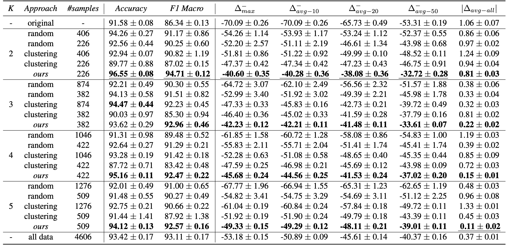
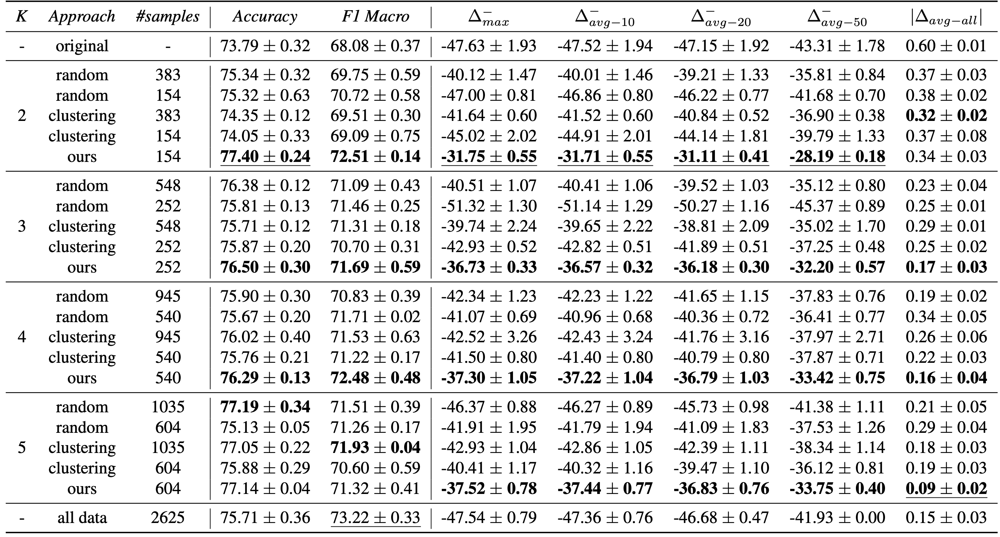

# Prioritizing Data Acquisition For End-to-End Speech Model Improvement

[](https://ieeexplore.ieee.org/abstract/document/10446326)

This repo contains the code for [**"Prioritizing Data Acquisition For End-to-End Speech Model Improvement"**](https://ieeexplore.ieee.org/abstract/document/10446326), accepted at ICASSP 2024.

In this repository, you will find the code to replicate our experiments.  

## Getting Started

### Data
We do not include the datasets used in the paper as they are publicly available and downloadable from the respective authors: [**FSC**](https://arxiv.org/abs/1904.03670) for English and [**ITALIC**](https://www.isca-archive.org/interspeech_2023/koudounas23_interspeech.html) for Italian. 
To make it work, you should put data files under data.

### Python Environment
Our code was tested on Python 3.11.2. To make it work, you will need:
- a working environment with the libraries listed in requirements.txt;
- a functioning torch installation in the same environment.

### Running the Experiments
Use the `ft_main.py` to finetune the required models, `inference.py` to evaluate them, and `divexplorer_analysis.ipynb` to explore subgroup divergence.

## Results
The first table shows the mean and standard deviation of three different runs for the [**FSC**](https://arxiv.org/abs/1904.03670) dataset with the [**wav2vec 2.0 base**](https://huggingface.co/facebook/wav2vec2-base) model. We compare the results for the original fine-tuning procedure, the two baselines (*random* and *clustering-based*) and *our divergence-aware* strategy. Best results for each number of considered subgroups K are highlighted in bold. Best results overall are underlined.



The second table summarizes the results in terms of mean and standard deviation of three different runs for the [**ITALIC**](https://www.isca-archive.org/interspeech_2023/koudounas23_interspeech.html) dataset with the [**XLSR large**](https://huggingface.co/facebook/wav2vec2-xls-r-300m) model. We again compare the original fine-tuning procedure with two baselines (*random* and *clustering-based*) and *our divergence-aware* strategy. The best results for each number of considered subgroups K are highlighted in bold, while the best results overall are underlined.



## Citation
If you use this code in your research, please cite our paper:

```bibtex
@INPROCEEDINGS{koudounas2024prioritizing,
  author={Koudounas, Alkis and Pastor, Eliana and Attanasio, Giuseppe and de Alfaro, Luca and Baralis, Elena},
  booktitle={ICASSP 2024 - 2024 IEEE International Conference on Acoustics, Speech and Signal Processing (ICASSP)}, 
  title={Prioritizing Data Acquisition for end-to-end Speech Model Improvement}, 
  year={2024},
  volume={},
  number={},
  pages={7000-7004},
  keywords={Training;Costs;Intent recognition;Data acquisition;Signal processing;Data models;Object recognition;spoken language understanding;data acquisition;data markets;divergence},
  doi={10.1109/ICASSP48485.2024.10446326}}
```

## License
This code is released under the Apache 2.0 license. See the [LICENSE](LICENSE) file for more details.

## Contact
For any questions, please contact [Alkis Koudounas](mailto:alkis.koudounas@polito.it).
